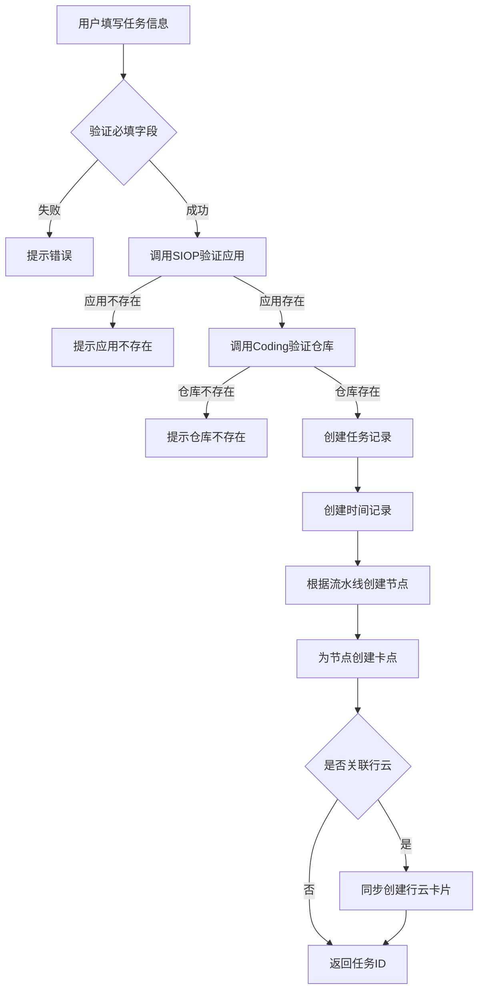
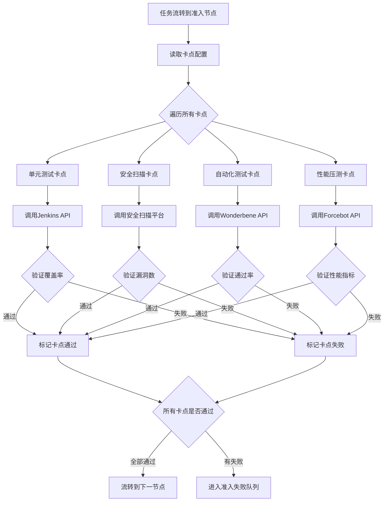

# 北即星(Caesar Platform) - AI 可读 PRD 文档

> **文档版本**: v1.0  
> **最后更新**: 2026-02-22  
> **目标读者**: AI 代码生成系统、开发工程师  
> **文档目的**: 提供完整的、结构化的产品需求,支持 AI 直接生成代码

---

## 📋 目录

1. [系统概述](#1-系统概述)
2. [核心概念与数据模型](#2-核心概念与数据模型)
3. [功能模块详细设计](#3-功能模块详细设计)
4. [API 接口规范](#4-api-接口规范)
5. [数据库设计](#5-数据库设计)
6. [业务流程](#6-业务流程)
7. [技术栈与架构](#7-技术栈与架构)
8. [非功能性需求](#8-非功能性需求)

---

## 1. 系统概述

### 1.1 产品定位

**北即星(Caesar Platform)** 是一个**企业级研发效能管理平台**,提供:
- 全流程项目管理(从需求到发布)
- 质量卡点自动化验证
- 多维度效能数据度量
- 研发协作工作流

### 1.2 核心价值

| 价值点 | 说明 |
|--------|------|
| 统一流程 | 通过流水线节点标准化研发流程 |
| 质量左移 | 提测前自动化准入验证,不合格自动打回 |
| 数据沉淀 | 记录项目全生命周期数据 |
| 效能度量 | 4 个维度(项目/质量/研发/工程成熟度)度量 |
| 协作提效 | 工单队列系统支持多方协作 |

### 1.3 用户角色

| 角色 | 职责 | 主要操作 |
|------|------|----------|
| 研发工程师 | 创建任务、提交代码、流转节点 | 创建任务、流转研发节点、查看准入结果 |
| 测试工程师 | 配置准入规则、执行测试、验证质量 | 配置卡点、流转测试节点、查看度量数据 |
| 产品经理 | 需求验收 | 产品验收队列操作 |
| 业务人员 | 业务验收 | 业务验收队列操作 |
| 架构师 | 架构评审 | 架构评审队列操作、评审意见录入 |
| 运维工程师 | 发布管理 | 发布队列操作、回滚管理 |
| 管理者 | 查看度量数据、决策支持 | 查看各类度量大盘 |

---

## 2. 核心概念与数据模型

### 2.1 核心实体关系

```
业务线(Business) 1:N 应用(Application) 1:N 任务(Task/FlowItem)
                                                    ↓
                                            流水线(Pipeline)
                                                    ↓
                                            节点(Node/FlowWorker)
                                                    ↓
                                            卡点(Gate/FlowWorkerItem)
```


### 2.2 核心实体定义

#### 2.2.1 任务(FlowItem)

**定义**: 项目迭代的最小工作单元

**核心属性**:
```typescript
interface FlowItem {
  id: string;                    // 任务 ID
  name: string;                  // 任务名称
  businessLine: string;          // 业务线
  application: string;           // 应用(CRN)
  pipelineId: string;            // 流水线 ID
  status: FlowItemStatus;        // 任务状态
  progress: number;              // 进度百分比(0-100)
  
  // 代码信息
  codeRepository: string;        // 代码仓库地址
  branch: string;                // 提测分支
  
  // 人员信息
  creator: string;               // 创建人
  devOwner: string;              // 研发负责人
  testOwner: string;             // 测试负责人
  
  // 时间信息
  createTime: Date;              // 创建时间
  planDevStartTime: Date;        // 计划研发开始时间
  actualDevStartTime: Date;      // 实际研发开始时间
  planTestStartTime: Date;       // 计划测试开始时间
  actualTestStartTime: Date;     // 实际测试开始时间
  planReleaseTime: Date;         // 计划发布时间
  actualReleaseTime: Date;       // 实际发布时间
  
  // 关联信息
  jiraCardId: string;            // 行云卡片 ID
  spaceId: string;               // 行云空间 ID
  sprintId: string;              // 行云迭代 ID
}
```

**状态枚举**:
```typescript
enum FlowItemStatus {
  ActionWait = 0,      // 等待操作
  ActionIng = 1,       // 操作中
  ActionSuccess = 2,   // 操作成功
  ActionFail = 3,      // 操作失败
  Canceled = 4,        // 已取消
  Finished = 5         // 已完成
}
```

#### 2.2.2 流水线(Pipeline)

**定义**: 定义任务流转的节点序列

**核心属性**:
```typescript
interface Pipeline {
  id: string;                    // 流水线 ID
  name: string;                  // 流水线名称
  description: string;           // 描述
  nodes: PipelineNode[];         // 节点列表(有序)
  isDefault: boolean;            // 是否默认流水线
}

interface PipelineNode {
  nodeId: string;                // 节点 ID
  nodeName: string;              // 节点名称
  nodeType: NodeType;            // 节点类型
  order: number;                 // 顺序
  isRequired: boolean;           // 是否必经节点
  gates: Gate[];                 // 卡点列表
}
```

**节点类型枚举**:
```typescript
enum NodeType {
  Dev = "dev",                   // 研发节点
  CodeReview = "code_review",    // Code Review 节点
  ArchReview = "arch_review",    // 架构评审节点
  Admission = "admission",       // 准入节点
  Test = "test",                 // 测试节点
  ProductAccept = "product_accept", // 产品验收节点
  BusinessAccept = "business_accept", // 业务验收节点
  Integration = "integration",   // 联调节点
  Release = "release",           // 发布节点
  Finish = "finish"              // 完成节点
}
```


#### 2.2.3 卡点(Gate)

**定义**: 节点流转的质量门禁

**核心属性**:
```typescript
interface Gate {
  id: string;                    // 卡点 ID
  name: string;                  // 卡点名称
  type: GateType;                // 卡点类型
  config: GateConfig;            // 卡点配置
  isRequired: boolean;           // 是否必须通过
}

enum GateType {
  UnitTest = "unit_test",        // 单元测试覆盖率
  SecurityScan = "security_scan", // 代码安全扫描
  AutoTest = "auto_test",        // 自动化测试
  PerformanceTest = "performance_test", // 性能压测
  CodeReview = "code_review"     // Code Review
}

interface GateConfig {
  // 单元测试配置
  unitTest?: {
    lineCoverage: number;        // 行覆盖率阈值(%)
    methodCoverage: number;      // 方法覆盖率阈值(%)
    classCoverage: number;       // 类覆盖率阈值(%)
  };
  
  // 安全扫描配置
  securityScan?: {
    maxHighRisk: number;         // 最大高危漏洞数
    maxMediumRisk: number;       // 最大中危漏洞数
  };
  
  // 自动化测试配置
  autoTest?: {
    taskId: string;              // Wonderbene 任务 ID
    passRate: number;            // 通过率阈值(%)
  };
  
  // 性能压测配置
  performanceTest?: {
    taskId: string;              // Forcebot 任务 ID
    maxResponseTime: number;     // 最大响应时间(ms)
    minTPS: number;              // 最小 TPS
  };
}
```

#### 2.2.4 工单队列(Queue)

**定义**: 不同角色的待办任务队列

**队列类型**:
```typescript
enum QueueType {
  ArchReview = "arch_review",    // 架构评审队列
  Release = "release",           // 发布队列
  AdmissionFail = "admission_fail", // 准入失败队列
  ProductAccept = "product_accept", // 产品验收队列
  BusinessAccept = "business_accept", // 业务验收队列
  Integration = "integration"    // 联调队列
}

interface QueueItem {
  id: string;                    // 队列项 ID
  taskId: string;                // 关联任务 ID
  queueType: QueueType;          // 队列类型
  status: QueueStatus;           // 队列状态
  assignee: string;              // 负责人
  createTime: Date;              // 进入队列时间
  updateTime: Date;              // 更新时间
}

enum QueueStatus {
  Pending = "pending",           // 待处理
  Processing = "processing",     // 处理中
  Completed = "completed",       // 已完成
  Rejected = "rejected"          // 已拒绝
}
```

---

## 3. 功能模块详细设计

### 3.1 工作台模块

#### 3.1.1 任务管理

**功能**: 创建、查询、操作任务

**核心用例**:

##### UC-001: 创建任务

**前置条件**: 用户已登录

**输入**:
- 任务名称
- 业务线
- 应用(CRN)
- 流水线选择
- 代码仓库地址
- 提测分支
- 研发负责人
- 测试负责人
- 计划时间(研发开始、测试开始、发布时间)
- 行云关联(可选): 空间 ID、迭代 ID、卡片 ID

**处理逻辑**:
1. 验证必填字段
2. 验证应用是否存在(调用 SIOP 接口)
3. 验证代码仓库是否存在(调用 Coding 接口)
4. 创建任务记录(flow_item 表)
5. 创建时间记录(flow_item_date 表)
6. 根据流水线创建节点记录(flow_worker 表)
7. 为每个节点创建卡点记录(flow_worker_item 表)
8. 初始化任务状态为 ActionWait
9. 如果关联行云,同步创建行云卡片

**输出**:
- 任务 ID
- 创建成功提示

**异常处理**:
- 应用不存在 → 提示"应用不存在,请先在 SIOP 创建"
- 代码仓库不存在 → 提示"代码仓库不存在"
- 行云同步失败 → 记录日志,不阻塞任务创建


##### UC-002: 任务流转

**前置条件**: 
- 任务存在且未完成
- 当前节点状态为 ActionWait

**输入**:
- 任务 ID
- 目标节点

**处理逻辑**:
1. 验证任务状态
2. 验证当前节点是否可流转
3. 如果当前节点有卡点,执行卡点验证:
   - 单元测试卡点 → 调用 Jenkins 获取覆盖率
   - 安全扫描卡点 → 调用安全扫描平台获取结果
   - 自动化测试卡点 → 调用 Wonderbene 获取结果
   - 性能压测卡点 → 调用 Forcebot 获取结果
   - Code Review 卡点 → 调用 Coding 获取 MR 记录
4. 所有卡点通过 → 流转到下一节点
5. 任何卡点失败 → 打回到上一节点,进入准入失败队列
6. 更新任务进度百分比
7. 如果流转到特定节点,创建工单队列记录:
   - 架构评审节点 → 创建架构评审队列
   - 产品验收节点 → 创建产品验收队列
   - 业务验收节点 → 创建业务验收队列
   - 联调节点 → 创建联调队列
   - 发布节点 → 创建发布队列

**输出**:
- 流转成功/失败状态
- 失败原因(如果失败)

**异常处理**:
- 卡点验证超时 → 标记为失败,记录日志
- 第三方接口调用失败 → 重试 3 次,仍失败则人工介入

##### UC-003: 任务取消

**前置条件**: 任务未完成

**输入**: 任务 ID

**处理逻辑**:
1. 验证任务状态
2. 更新任务状态为 Canceled
3. 更新进度为 100%
4. 记录取消时间和操作人
5. 如果关联行云,同步更新行云卡片状态

**输出**: 取消成功提示

**注意**: 任务取消后不可恢复

##### UC-004: 任务查询

**输入**(筛选条件):
- 任务名称(模糊搜索)
- 业务线
- 应用
- 创建人
- 状态
- 创建时间范围

**输出**: 任务列表(分页)

**列表字段**:
- 任务 ID
- 任务名称
- 业务线
- 应用
- 当前节点
- 进度
- 创建时间
- 创建人
- 操作按钮(操作/取消/查看)

#### 3.1.2 任务详情操作

##### UC-005: 变更任务信息

**可变更字段**:
- 任务名称
- 研发负责人
- 测试负责人
- 计划时间

**不可变更字段**:
- 业务线
- 应用
- 流水线
- 代码仓库
- 提测分支

##### UC-006: 添加过程任务

**功能**: 在任务执行过程中添加子任务

**输入**:
- 子任务类型(需求变更/Bug 修复/优化)
- 子任务描述
- 是否同步到行云

**处理逻辑**:
1. 创建子任务记录
2. 关联到父任务
3. 如果选择同步,调用行云接口创建子卡片

##### UC-007: 变更测试时间

**功能**: 调整测试阶段的执行时间

**输入**:
- 新的测试开始时间
- 新的测试结束时间
- 变更原因

**处理逻辑**:
1. 验证新时间的合理性
2. 更新 flow_item_date 表
3. 记录变更历史

##### UC-008: 配置准入卡点

**功能**: 为任务配置提测准入卡点

**输入**:
- 卡点类型(单测/安全扫描/自动化/性能)
- 卡点配置参数

**处理逻辑**:
1. 验证卡点类型
2. 验证配置参数
3. 创建卡点记录(flow_item_list 表)
4. 关联到准入节点

**示例 - 单元测试卡点配置**:
```json
{
  "type": "unit_test",
  "config": {
    "codeRepository": "coding.jd.com/app/passport.jd.com",
    "branch": "feature/login",
    "projectSpace": "coding.jd.com/app/passport.jd.com/",
    "jobName": "Unittest-passport.jd.com_chenlei",
    "lineCoverage": 80,
    "methodCoverage": 75,
    "classCoverage": 70
  }
}
```


### 3.2 架构评审模块

#### 3.2.1 架构评审队列

**功能**: 管理需要架构评审的任务

##### UC-009: 架构评审列表

**输入**(筛选条件):
- 状态(新入队列/已通过)
- 业务线
- 应用
- 时间范围

**输出**: 评审工单列表

**列表字段**:
- 工单 ID
- 任务名称
- 业务线
- 应用
- 研发负责人
- 进入队列时间
- 状态
- 操作按钮(意见/通过)

##### UC-010: 录入评审意见

**输入**:
- 工单 ID
- 评审意见内容
- 是否采纳(是/否)
- 评审人

**处理逻辑**:
1. 验证工单状态
2. 保存评审意见
3. 标记意见是否被采纳
4. 支持多次补录意见

**输出**: 保存成功提示

##### UC-011: 通过架构评审

**前置条件**: 
- 工单状态为"新入队列"
- 至少有一条评审意见

**输入**: 工单 ID

**处理逻辑**:
1. 验证是否有评审意见
2. 更新工单状态为"已通过"
3. 更新任务节点状态
4. 流转任务到下一节点

**输出**: 通过成功提示

### 3.3 工单队列模块

#### 3.3.1 发布队列

**功能**: 管理待发布和已发布的任务

##### UC-012: 发布队列操作

**队列状态**:
- 待发布
- 发布中
- 发布成功
- 发布失败
- 已回滚

**操作**:
- 查看发布详情
- 触发发布(调用 SIOP 发布接口)
- 查看发布结果
- 触发回滚

**数据收集**:
- 发布时间
- 发布人
- 发布结果
- 回滚时间(如果回滚)
- 回滚原因

#### 3.3.2 准入失败队列

**功能**: 管理准入验证失败的任务

##### UC-013: 准入失败队列操作

**队列字段**:
- 任务信息
- 失败的卡点类型
- 失败原因
- 失败时间
- 操作按钮(重新运行/打回研发)

**操作**:

1. **重新运行准入验证**:
   - 重新调用卡点验证接口
   - 如果通过,流转到下一节点
   - 如果仍失败,保持在队列中

2. **打回研发节点**:
   - 确认失败原因
   - 将任务打回到研发节点
   - 从队列中移除

#### 3.3.3 产品验收队列

**功能**: 产品经理验收需求

##### UC-014: 产品验收操作

**输入**:
- 验收结果(通过/不通过)
- 验收意见
- 附件上传(支持富文本)

**处理逻辑**:
1. 保存验收结果
2. 如果通过,流转到下一节点
3. 如果不通过,打回到测试节点

#### 3.3.4 业务验收队列

**功能**: 业务人员验收功能

**操作逻辑**: 同产品验收队列

#### 3.3.5 联调队列

**功能**: 管理需要多方联调的任务

##### UC-015: 联调队列操作

**输入**:
- 联调状态(联调中/联调完成)
- 联调说明
- 参与方确认

**处理逻辑**:
1. 记录联调状态
2. 所有参与方确认后,流转到下一节点


### 3.4 压力测试模块

#### 3.4.1 场景管理

**功能**: 管理压测场景配置

##### UC-016: 创建压测场景

**输入**:
- 场景名称
- 应用
- 压测接口列表
- 并发配置
- 持续时间
- 预期指标(TPS、响应时间)

**输出**: 场景 ID

#### 3.4.2 压测数据同步

**功能**: 从 Forcebot 同步压测数据

##### UC-017: 同步压测结果

**数据源**: Forcebot Open API

**同步数据**:
- 任务执行状态
- TPS 数据
- 响应时间数据
- 错误率
- 机器资源使用情况

**同步频率**: 实时同步(任务执行时)

#### 3.4.3 压测数据分析

**功能**: 分析压测结果,生成报告

##### UC-018: 生成压测报告

**分析维度**:
- 性能指标趋势
- 瓶颈分析
- 资源使用分析
- 与基线对比

**输出**: 压测分析报告(PDF/HTML)

#### 3.4.4 常态化压测

**功能**: 定期自动执行压测任务

##### UC-019: 配置常态化任务

**输入**:
- 任务名称
- 压测场景
- 执行频率(每日/每周/每月)
- 执行时间
- 基线配置

**处理逻辑**:
1. 创建常态化任务配置
2. 定时调度执行
3. 自动收集结果
4. 与基线对比
5. 异常自动告警

##### UC-020: 查询常态化任务结果

**输入**: 任务 ID、时间范围

**输出**: 
- 执行历史列表
- 每次执行的详细结果
- 趋势图表

### 3.5 基础配置模块

#### 3.5.1 流水线配置

**功能**: 配置项目流水线模板

##### UC-021: 创建流水线

**输入**:
- 流水线名称
- 节点列表(有序)
- 每个节点的配置:
  - 节点名称
  - 节点类型
  - 是否必经节点
  - 默认卡点配置

**示例流水线**:
```json
{
  "name": "标准研发流水线",
  "nodes": [
    {
      "order": 1,
      "name": "研发节点",
      "type": "dev",
      "isRequired": true,
      "gates": []
    },
    {
      "order": 2,
      "name": "Code Review",
      "type": "code_review",
      "isRequired": true,
      "gates": [
        {
          "type": "code_review",
          "config": {
            "minReviewers": 1
          }
        }
      ]
    },
    {
      "order": 3,
      "name": "架构评审",
      "type": "arch_review",
      "isRequired": false,
      "gates": []
    },
    {
      "order": 4,
      "name": "提测准入",
      "type": "admission",
      "isRequired": true,
      "gates": [
        {
          "type": "unit_test",
          "config": {
            "lineCoverage": 80
          }
        },
        {
          "type": "security_scan",
          "config": {
            "maxHighRisk": 0
          }
        }
      ]
    },
    {
      "order": 5,
      "name": "测试节点",
      "type": "test",
      "isRequired": true,
      "gates": []
    },
    {
      "order": 6,
      "name": "产品验收",
      "type": "product_accept",
      "isRequired": false,
      "gates": []
    },
    {
      "order": 7,
      "name": "发布节点",
      "type": "release",
      "isRequired": true,
      "gates": []
    },
    {
      "order": 8,
      "name": "完成",
      "type": "finish",
      "isRequired": true,
      "gates": []
    }
  ]
}
```

#### 3.5.2 卡点配置

**功能**: 配置全局卡点模板

##### UC-022: 配置卡点模板

**卡点类型及配置**:

1. **单元测试卡点**:
```json
{
  "type": "unit_test",
  "name": "单元测试覆盖率",
  "config": {
    "lineCoverage": 80,
    "methodCoverage": 75,
    "classCoverage": 70
  }
}
```

2. **安全扫描卡点**:
```json
{
  "type": "security_scan",
  "name": "代码安全扫描",
  "config": {
    "maxHighRisk": 0,
    "maxMediumRisk": 5,
    "maxLowRisk": 10
  }
}
```

3. **自动化测试卡点**:
```json
{
  "type": "auto_test",
  "name": "自动化测试",
  "config": {
    "passRate": 95,
    "maxFailedCases": 2
  }
}
```

4. **性能压测卡点**:
```json
{
  "type": "performance_test",
  "name": "性能压测",
  "config": {
    "maxResponseTime": 200,
    "minTPS": 1000,
    "maxErrorRate": 0.01
  }
}
```

#### 3.5.3 测试 Checklist 配置

**功能**: 配置测试检查清单模板

##### UC-023: 配置 Checklist

**输入**:
- Checklist 名称
- 检查项列表:
  - 检查项名称
  - 检查项描述
  - 是否必选

**示例**:
```json
{
  "name": "功能测试 Checklist",
  "items": [
    {
      "name": "功能正常性测试",
      "description": "验证所有功能点按预期工作",
      "isRequired": true
    },
    {
      "name": "边界值测试",
      "description": "验证边界条件处理",
      "isRequired": true
    },
    {
      "name": "异常场景测试",
      "description": "验证异常情况处理",
      "isRequired": true
    },
    {
      "name": "兼容性测试",
      "description": "验证不同环境兼容性",
      "isRequired": false
    }
  ]
}
```


### 3.6 效能度量模块

#### 3.6.1 项目大盘

**功能**: 从项目维度展示度量数据

##### UC-024: 项目大盘数据

**筛选条件**:
- 时间范围
- 业务线

**核心指标**:

1. **任务统计**:
```typescript
interface ProjectMetrics {
  releasedCount: number;        // 已发布任务数
  testingCount: number;         // 测试中任务数
  createdCount: number;         // 新创建任务数
  admissionFailCount: number;   // 准入失败任务数
  rollbackCount: number;        // 回滚任务数
  delayCount: number;           // 提测延期任务数
}
```

2. **发布项目总览**:
- 时间维度: 发布时间
- 展示: 全部业务的发布热点图(热力图)

3. **项目发布占比**:
- 时间维度: 发布时间
- 展示: 选定业务的发布占比(饼图)

4. **活跃任务情况**:
- 时间维度: 创建任务日期
- 展示: 任务创建趋势(折线图)

#### 3.6.2 质量大盘

**功能**: 从质量维度展示度量数据

##### UC-025: 质量大盘数据

**筛选条件**:
- 时间范围
- 业务线
- 应用

**核心指标**:

1. **Bug 统计**:
```typescript
interface QualityMetrics {
  totalBugCount: number;        // Bug 总数
  p0BugCount: number;           // P0 级别 Bug 数
  unresolvedBugCount: number;   // 未解决 Bug 数
}
```

2. **质量情况**:
- 时间维度: 提测时间
- 展示: Bug 引入阶段分布(堆叠柱状图)
  - 需求阶段
  - 设计阶段
  - 开发阶段
  - 测试阶段
  - 发布后

3. **Bug 情况**:
- 时间维度: 提测时间
- 展示: 各业务线 Bug 数量对比(柱状图)

4. **Bug 级别分布**:
- 时间维度: 提测时间
- 展示: Bug 级别分布(饼图)
  - P0: 致命
  - P1: 严重
  - P2: 一般
  - P3: 轻微

**数据来源**: Jira API

#### 3.6.3 研发质量

**功能**: 从研发资源维度展示度量数据

##### UC-026: 研发质量数据

**筛选条件**:
- 时间范围
- 业务线

**核心指标**:

1. **项目总览**:
- 时间维度: 研发时间(研发节点更新时间)
- 展示: 研发节点资源趋势(折线图)
  - 研发中任务数
  - 研发人员数

2. **代码量统计**:
- 时间维度: 研发时间
- 展示: 业务线维度代码变动量(柱状图)
  - 新增行数
  - 修改行数
  - 删除行数

**数据来源**: Coding API

3. **Bug 情况**:
- 时间维度: 研发时间
- 展示: 业务线维度 Bug 数量(折线图)

**计算公式**:
```typescript
// 千行代码 Bug 率
const bugRate = (bugCount / (addedLines + modifiedLines)) * 1000;
```

#### 3.6.4 工程成熟度大盘

**功能**: 从工程质量和稳定性维度展示度量数据

##### UC-027: 工程成熟度数据

**筛选条件**:
- 时间范围
- 业务线
- 应用

**核心指标**:

1. **工程成熟度评分**:
```typescript
interface EngineeringMaturity {
  score: number;                // 总分(0-100)
  level: string;                // 等级(优秀/良好/合格/不合格)
  
  // 测试维度
  unitTestCoverage: number;     // 单测覆盖率
  bugRate: number;              // 千行代码 Bug 率
  
  // 运维维度
  stability: number;            // 稳定性指标
  riskEliminationRate: number;  // 风险消除率
  alertHandlingRate: number;    // 报警处置率
}
```

2. **评分标准**:
```typescript
const maturityLevels = {
  excellent: { min: 90, max: 100 },  // 优秀
  good: { min: 80, max: 89 },        // 良好
  qualified: { min: 60, max: 79 },   // 合格
  unqualified: { min: 0, max: 59 }   // 不合格
};
```

3. **单测覆盖率趋势**:
- 时间维度: 月度
- 展示: 应用维度单测覆盖率趋势(折线图)
  - 行覆盖率
  - 类覆盖率
  - 方法覆盖率

4. **千行代码 Bug 率趋势**:
- 时间维度: 月度
- 展示: 应用维度千行 Bug 率趋势(折线图)

5. **稳定性趋势**:
- 时间维度: 月度
- 展示: 应用维度稳定性趋势(折线图)

**计算公式**:
```typescript
// 稳定性指标 = (总运行时长 - 故障时长) / 总运行时长 * 100%
const stability = ((totalRuntime - faultDuration) / totalRuntime) * 100;

// 风险消除率 = 本月风险消除卡片数 / 本月总卡片数 * 100%
const riskEliminationRate = (eliminatedCards / totalCards) * 100;

// 报警处置率 = (总报警数 - 超24小时未处理报警数) / 总报警数 * 100%
const alertHandlingRate = ((totalAlerts - overdueAlerts) / totalAlerts) * 100;
```

**数据来源**:
- 单测覆盖率: Jenkins API
- Bug 数据: Jira API
- 稳定性数据: SIOP API
- 风险数据: 行云 API
- 报警数据: SIOP API


---

## 4. API 接口规范

### 4.1 任务管理接口

#### 4.1.1 创建任务

```http
POST /platform/workflow/create
Content-Type: application/json

Request Body:
{
  "name": "用户登录功能优化",
  "businessLine": "基础账号",
  "application": "crn:jdapp:JONE:passport.jd.com",
  "pipelineId": "pipeline_001",
  "codeRepository": "coding.jd.com/app/passport.jd.com",
  "branch": "feature/login-optimize",
  "devOwner": "zhangsan",
  "testOwner": "lisi",
  "planDevStartTime": "2024-01-01T09:00:00Z",
  "planTestStartTime": "2024-01-10T09:00:00Z",
  "planReleaseTime": "2024-01-15T09:00:00Z",
  "jiraCardId": "CARD-12345",
  "spaceId": "space_001",
  "sprintId": "sprint_001"
}

Response:
{
  "code": 200,
  "message": "创建成功",
  "data": {
    "taskId": "task_001",
    "status": "ActionWait"
  }
}
```

#### 4.1.2 查询任务列表

```http
GET /platform/workflow/list
Query Parameters:
  - name: 任务名称(可选)
  - businessLine: 业务线(可选)
  - application: 应用(可选)
  - creator: 创建人(可选)
  - status: 状态(可选)
  - startTime: 开始时间(可选)
  - endTime: 结束时间(可选)
  - page: 页码(默认 1)
  - pageSize: 每页数量(默认 20)

Response:
{
  "code": 200,
  "message": "查询成功",
  "data": {
    "total": 100,
    "page": 1,
    "pageSize": 20,
    "list": [
      {
        "id": "task_001",
        "name": "用户登录功能优化",
        "businessLine": "基础账号",
        "application": "passport.jd.com",
        "currentNode": "测试节点",
        "progress": 60,
        "status": "ActionIng",
        "createTime": "2024-01-01T09:00:00Z",
        "creator": "zhangsan"
      }
    ]
  }
}
```

#### 4.1.3 任务流转

```http
POST /platform/workflow/flow
Content-Type: application/json

Request Body:
{
  "taskId": "task_001",
  "action": "next"  // next: 流转下一节点, back: 打回上一节点
}

Response:
{
  "code": 200,
  "message": "流转成功",
  "data": {
    "currentNode": "测试节点",
    "nextNode": "产品验收节点",
    "gateResults": [
      {
        "gateType": "unit_test",
        "passed": true,
        "details": {
          "lineCoverage": 85,
          "methodCoverage": 80,
          "classCoverage": 75
        }
      }
    ]
  }
}

// 流转失败响应
{
  "code": 400,
  "message": "准入验证失败",
  "data": {
    "failedGates": [
      {
        "gateType": "unit_test",
        "passed": false,
        "reason": "行覆盖率不足: 实际 75%, 要求 80%"
      }
    ]
  }
}
```

#### 4.1.4 取消任务

```http
POST /platform/workflow/cancel
Content-Type: application/json

Request Body:
{
  "taskId": "task_001"
}

Response:
{
  "code": 200,
  "message": "取消成功"
}
```

#### 4.1.5 配置准入卡点

```http
POST /platform/workflow/gate/config
Content-Type: application/json

Request Body:
{
  "taskId": "task_001",
  "gates": [
    {
      "type": "unit_test",
      "config": {
        "codeRepository": "coding.jd.com/app/passport.jd.com",
        "branch": "feature/login",
        "projectSpace": "coding.jd.com/app/passport.jd.com/",
        "jobName": "Unittest-passport.jd.com_chenlei",
        "lineCoverage": 80,
        "methodCoverage": 75,
        "classCoverage": 70
      }
    },
    {
      "type": "security_scan",
      "config": {
        "maxHighRisk": 0,
        "maxMediumRisk": 5
      }
    }
  ]
}

Response:
{
  "code": 200,
  "message": "配置成功"
}
```

### 4.2 架构评审接口

#### 4.2.1 查询架构评审队列

```http
GET /platform/flowqueue/archQueue
Query Parameters:
  - status: 状态(pending/completed)
  - businessLine: 业务线(可选)
  - page: 页码
  - pageSize: 每页数量

Response:
{
  "code": 200,
  "data": {
    "total": 50,
    "list": [
      {
        "id": "arch_001",
        "taskId": "task_001",
        "taskName": "用户登录功能优化",
        "businessLine": "基础账号",
        "application": "passport.jd.com",
        "devOwner": "zhangsan",
        "status": "pending",
        "createTime": "2024-01-05T09:00:00Z"
      }
    ]
  }
}
```

#### 4.2.2 录入评审意见

```http
POST /platform/flowqueue/archQueue/comment
Content-Type: application/json

Request Body:
{
  "queueId": "arch_001",
  "comment": "架构设计合理,建议增加缓存层",
  "isAdopted": true,
  "reviewer": "wangwu"
}

Response:
{
  "code": 200,
  "message": "意见录入成功"
}
```

#### 4.2.3 通过架构评审

```http
POST /platform/flowqueue/archQueue/approve
Content-Type: application/json

Request Body:
{
  "queueId": "arch_001"
}

Response:
{
  "code": 200,
  "message": "评审通过"
}
```

### 4.3 工单队列接口

#### 4.3.1 查询准入失败队列

```http
GET /platform/failqueue/list
Query Parameters:
  - businessLine: 业务线(可选)
  - gateType: 卡点类型(可选)
  - page: 页码
  - pageSize: 每页数量

Response:
{
  "code": 200,
  "data": {
    "total": 10,
    "list": [
      {
        "id": "fail_001",
        "taskId": "task_001",
        "taskName": "用户登录功能优化",
        "failedGate": "unit_test",
        "failReason": "行覆盖率不足",
        "createTime": "2024-01-08T10:00:00Z"
      }
    ]
  }
}
```

#### 4.3.2 重新运行准入验证

```http
POST /platform/failqueue/retry
Content-Type: application/json

Request Body:
{
  "queueId": "fail_001"
}

Response:
{
  "code": 200,
  "message": "重新验证中",
  "data": {
    "status": "running"
  }
}
```

#### 4.3.3 打回研发节点

```http
POST /platform/failqueue/reject
Content-Type: application/json

Request Body:
{
  "queueId": "fail_001",
  "reason": "单测覆盖率不达标,需补充测试用例"
}

Response:
{
  "code": 200,
  "message": "已打回研发节点"
}
```


### 4.4 度量数据接口

#### 4.4.1 项目大盘数据

```http
GET /platform/report/project
Query Parameters:
  - startTime: 开始时间
  - endTime: 结束时间
  - businessLine: 业务线(可选)

Response:
{
  "code": 200,
  "data": {
    "metrics": {
      "releasedCount": 45,
      "testingCount": 12,
      "createdCount": 60,
      "admissionFailCount": 8,
      "rollbackCount": 2,
      "delayCount": 10
    },
    "releaseHeatmap": [
      {
        "date": "2024-01-01",
        "businessLine": "基础账号",
        "count": 5
      }
    ],
    "releaseDistribution": [
      {
        "businessLine": "基础账号",
        "count": 20,
        "percentage": 44.4
      }
    ],
    "taskTrend": [
      {
        "date": "2024-01-01",
        "count": 5
      }
    ]
  }
}
```

#### 4.4.2 质量大盘数据

```http
GET /platform/report/quality
Query Parameters:
  - startTime: 开始时间
  - endTime: 结束时间
  - businessLine: 业务线(可选)
  - application: 应用(可选)

Response:
{
  "code": 200,
  "data": {
    "metrics": {
      "totalBugCount": 1234,
      "p0BugCount": 321,
      "unresolvedBugCount": 500
    },
    "bugPhaseDistribution": [
      {
        "phase": "需求阶段",
        "count": 100
      },
      {
        "phase": "开发阶段",
        "count": 500
      }
    ],
    "bugByBusinessLine": [
      {
        "businessLine": "基础账号",
        "count": 300
      }
    ],
    "bugLevelDistribution": [
      {
        "level": "P0",
        "count": 321
      }
    ]
  }
}
```

#### 4.4.3 研发质量数据

```http
GET /platform/report/dev-quality
Query Parameters:
  - startTime: 开始时间
  - endTime: 结束时间
  - businessLine: 业务线(可选)

Response:
{
  "code": 200,
  "data": {
    "resourceTrend": [
      {
        "date": "2024-01",
        "taskCount": 50,
        "developerCount": 20
      }
    ],
    "codeMetrics": [
      {
        "businessLine": "基础账号",
        "addedLines": 10000,
        "modifiedLines": 5000,
        "deletedLines": 2000
      }
    ],
    "bugTrend": [
      {
        "date": "2024-01",
        "businessLine": "基础账号",
        "bugCount": 50,
        "bugRate": 5.5  // 千行代码 Bug 率
      }
    ]
  }
}
```

#### 4.4.4 工程成熟度数据

```http
GET /platform/report/engineering-maturity
Query Parameters:
  - startTime: 开始时间
  - endTime: 结束时间
  - businessLine: 业务线(可选)
  - application: 应用(可选)

Response:
{
  "code": 200,
  "data": {
    "maturityScore": {
      "score": 85,
      "level": "良好",
      "unitTestCoverage": 82,
      "bugRate": 3.5,
      "stability": 99.9,
      "riskEliminationRate": 95,
      "alertHandlingRate": 98
    },
    "unitTestTrend": [
      {
        "date": "2024-01",
        "application": "passport.jd.com",
        "lineCoverage": 82,
        "classCoverage": 78,
        "methodCoverage": 80
      }
    ],
    "bugRateTrend": [
      {
        "date": "2024-01",
        "application": "passport.jd.com",
        "bugRate": 3.5
      }
    ],
    "stabilityTrend": [
      {
        "date": "2024-01",
        "application": "passport.jd.com",
        "stability": 99.9
      }
    ]
  }
}
```

### 4.5 第三方接口集成

#### 4.5.1 行云(Jira)接口

**用途**: 同步任务、查询空间、迭代

```typescript
// 查询行云卡片
GET http://api-gateway.jd.com/jacp/api/rest/spaces/card/{cardId}

// 创建行云卡片
POST http://api-gateway.jd.com/jacp/api/rest/spaces/{spaceId}/card

// 查询空间
GET http://api-gateway.jd.com/jacp/api/rest/space/

// 查询迭代
GET http://api-gateway.jd.com/jacp/api/rest/spaces/sprint/

// 同步行云任务
POST http://api-gateway.jd.com/jacp/api/rest/space/{spaceId}/card
```

#### 4.5.2 Jira 接口

**用途**: 查询 Bug 数据

```typescript
GET http://jsec.jira.jd.com/rest/api/2/search?startAt=0&maxResults=200&jql={jql}

// JQL 示例
jql = "project = JSEC AND created >= '2024-01-01' AND created <= '2024-01-31'"
```

#### 4.5.3 Coding 接口

**用途**: 查询代码变动、Code Review 数据

```typescript
// 查询代码提交
GET http://coding.jd.com/api/v4/projects/{space_and_repository}/repository/commits?since={startDate}&until={endDate}

// 查询 Code Review(MR)
GET http://coding.jd.com/api/v4/projects/{space_and_repository}/merge_requests?state=merged&created_after={startDate}
```

#### 4.5.4 SIOP 接口

**用途**: 查询业务、系统、应用信息

```typescript
// 查询业务列表
GET http://siop.jd.com/prod-api/svc/biz/list

// 查询应用信息
GET http://siop.jd.com/prod-api/svc/jdapp/baseinfo/list?crn={crn}
```

#### 4.5.5 安全扫描接口

**用途**: 触发安全扫描、获取扫描结果

```typescript
// 触发扫描
POST http://codecheck.jd.com/addapicheck
Body: {
  "codeRepository": "...",
  "branch": "..."
}

// 结果通过 JMQ 异步返回
// 监听 JMQ Topic: security_scan_result
```

#### 4.5.6 Jenkins 接口

**用途**: 触发单元测试、获取覆盖率

```typescript
// 触发 Job
POST http://jsec-jenkins.jd.com/jenkins/job/{jobName}/build

// 获取覆盖率结果
GET http://jsec-jenkins.jd.com/jenkins/job/{jobName}/{buildNumber}/jacoco/api/json
```

#### 4.5.7 Forcebot 接口

**用途**: 常态化压测管理

```typescript
// 查询常态化任务
GET http://forcebot-open-api.jd.com/api/usual/items

// 触发任务执行
POST http://forcebot-open-api.jd.com/api/usual/run
Body: {
  "taskId": "..."
}

// 检查执行状态
GET http://forcebot-open-api.jd.com/api/task/{taskId}/status

// 查询执行结果
GET http://forcebot-open-api.jd.com/api/task/finish/summary/{taskId}
```

#### 4.5.8 MDC 接口

**用途**: 查询机器指标数据

```typescript
// 查询指标
POST http://mlaas-gateway.jd.local/mdc/v2/open/metric/range_query
Body: {
  "query": "cpu_usage{app='passport.jd.com'}",
  "start": "2024-01-01T00:00:00Z",
  "end": "2024-01-31T23:59:59Z",
  "step": "5m"
}
```

#### 4.5.9 UMP 接口

**用途**: 查询 JVM 和 UMP 监控数据

```typescript
// 查询监控数据
POST http://open.ump.jd.com/queryMonitorData
Body: {
  "appKey": "...",
  "startTime": "...",
  "endTime": "...",
  "metrics": ["jvm.memory.used", "jvm.gc.count"]
}
```


---

## 5. 数据库设计

### 5.1 核心表结构

#### 5.1.1 任务表(flow_item)

```sql
CREATE TABLE flow_item (
  id VARCHAR(64) PRIMARY KEY COMMENT '任务ID',
  name VARCHAR(255) NOT NULL COMMENT '任务名称',
  business_line VARCHAR(100) NOT NULL COMMENT '业务线',
  application VARCHAR(255) NOT NULL COMMENT '应用CRN',
  pipeline_id VARCHAR(64) NOT NULL COMMENT '流水线ID',
  status TINYINT NOT NULL DEFAULT 0 COMMENT '任务状态: 0-等待 1-进行中 2-成功 3-失败 4-取消 5-完成',
  progress INT NOT NULL DEFAULT 0 COMMENT '进度百分比(0-100)',
  
  code_repository VARCHAR(500) COMMENT '代码仓库地址',
  branch VARCHAR(100) COMMENT '提测分支',
  
  creator VARCHAR(50) NOT NULL COMMENT '创建人',
  dev_owner VARCHAR(50) COMMENT '研发负责人',
  test_owner VARCHAR(50) COMMENT '测试负责人',
  
  jira_card_id VARCHAR(100) COMMENT '行云卡片ID',
  space_id VARCHAR(100) COMMENT '行云空间ID',
  sprint_id VARCHAR(100) COMMENT '行云迭代ID',
  
  create_time DATETIME NOT NULL DEFAULT CURRENT_TIMESTAMP COMMENT '创建时间',
  update_time DATETIME NOT NULL DEFAULT CURRENT_TIMESTAMP ON UPDATE CURRENT_TIMESTAMP COMMENT '更新时间',
  
  INDEX idx_business_line (business_line),
  INDEX idx_application (application),
  INDEX idx_creator (creator),
  INDEX idx_status (status),
  INDEX idx_create_time (create_time)
) ENGINE=InnoDB DEFAULT CHARSET=utf8mb4 COMMENT='任务表';
```

#### 5.1.2 任务时间表(flow_item_date)

```sql
CREATE TABLE flow_item_date (
  id VARCHAR(64) PRIMARY KEY COMMENT 'ID',
  task_id VARCHAR(64) NOT NULL COMMENT '任务ID',
  
  plan_dev_start_time DATETIME COMMENT '计划研发开始时间',
  actual_dev_start_time DATETIME COMMENT '实际研发开始时间',
  plan_dev_end_time DATETIME COMMENT '计划研发结束时间',
  actual_dev_end_time DATETIME COMMENT '实际研发结束时间',
  
  plan_test_start_time DATETIME COMMENT '计划测试开始时间',
  actual_test_start_time DATETIME COMMENT '实际测试开始时间',
  plan_test_end_time DATETIME COMMENT '计划测试结束时间',
  actual_test_end_time DATETIME COMMENT '实际测试结束时间',
  
  plan_release_time DATETIME COMMENT '计划发布时间',
  actual_release_time DATETIME COMMENT '实际发布时间',
  
  create_time DATETIME NOT NULL DEFAULT CURRENT_TIMESTAMP COMMENT '创建时间',
  update_time DATETIME NOT NULL DEFAULT CURRENT_TIMESTAMP ON UPDATE CURRENT_TIMESTAMP COMMENT '更新时间',
  
  UNIQUE KEY uk_task_id (task_id),
  FOREIGN KEY (task_id) REFERENCES flow_item(id)
) ENGINE=InnoDB DEFAULT CHARSET=utf8mb4 COMMENT='任务时间表';
```

#### 5.1.3 任务节点表(flow_worker)

```sql
CREATE TABLE flow_worker (
  id VARCHAR(64) PRIMARY KEY COMMENT '节点ID',
  task_id VARCHAR(64) NOT NULL COMMENT '任务ID',
  node_name VARCHAR(100) NOT NULL COMMENT '节点名称',
  node_type VARCHAR(50) NOT NULL COMMENT '节点类型',
  node_order INT NOT NULL COMMENT '节点顺序',
  status TINYINT NOT NULL DEFAULT 0 COMMENT '节点状态: 0-等待 1-进行中 2-成功 3-失败',
  is_required TINYINT NOT NULL DEFAULT 1 COMMENT '是否必经节点: 0-否 1-是',
  
  start_time DATETIME COMMENT '开始时间',
  end_time DATETIME COMMENT '结束时间',
  
  create_time DATETIME NOT NULL DEFAULT CURRENT_TIMESTAMP COMMENT '创建时间',
  update_time DATETIME NOT NULL DEFAULT CURRENT_TIMESTAMP ON UPDATE CURRENT_TIMESTAMP COMMENT '更新时间',
  
  INDEX idx_task_id (task_id),
  INDEX idx_node_order (task_id, node_order),
  FOREIGN KEY (task_id) REFERENCES flow_item(id)
) ENGINE=InnoDB DEFAULT CHARSET=utf8mb4 COMMENT='任务节点表';
```

#### 5.1.4 节点卡点表(flow_worker_item)

```sql
CREATE TABLE flow_worker_item (
  id VARCHAR(64) PRIMARY KEY COMMENT '卡点ID',
  worker_id VARCHAR(64) NOT NULL COMMENT '节点ID',
  task_id VARCHAR(64) NOT NULL COMMENT '任务ID',
  gate_type VARCHAR(50) NOT NULL COMMENT '卡点类型',
  gate_config TEXT COMMENT '卡点配置(JSON)',
  status TINYINT NOT NULL DEFAULT 0 COMMENT '卡点状态: 0-等待 1-进行中 2-通过 3-失败',
  is_required TINYINT NOT NULL DEFAULT 1 COMMENT '是否必须通过: 0-否 1-是',
  
  result TEXT COMMENT '验证结果(JSON)',
  fail_reason VARCHAR(500) COMMENT '失败原因',
  
  execute_time DATETIME COMMENT '执行时间',
  
  create_time DATETIME NOT NULL DEFAULT CURRENT_TIMESTAMP COMMENT '创建时间',
  update_time DATETIME NOT NULL DEFAULT CURRENT_TIMESTAMP ON UPDATE CURRENT_TIMESTAMP COMMENT '更新时间',
  
  INDEX idx_worker_id (worker_id),
  INDEX idx_task_id (task_id),
  INDEX idx_gate_type (gate_type),
  FOREIGN KEY (worker_id) REFERENCES flow_worker(id),
  FOREIGN KEY (task_id) REFERENCES flow_item(id)
) ENGINE=InnoDB DEFAULT CHARSET=utf8mb4 COMMENT='节点卡点表';
```

#### 5.1.5 准入卡点详情表(flow_item_list)

```sql
CREATE TABLE flow_item_list (
  id VARCHAR(64) PRIMARY KEY COMMENT 'ID',
  task_id VARCHAR(64) NOT NULL COMMENT '任务ID',
  gate_type VARCHAR(50) NOT NULL COMMENT '卡点类型',
  gate_config TEXT COMMENT '卡点配置(JSON)',
  
  create_time DATETIME NOT NULL DEFAULT CURRENT_TIMESTAMP COMMENT '创建时间',
  update_time DATETIME NOT NULL DEFAULT CURRENT_TIMESTAMP ON UPDATE CURRENT_TIMESTAMP COMMENT '更新时间',
  
  INDEX idx_task_id (task_id),
  FOREIGN KEY (task_id) REFERENCES flow_item(id)
) ENGINE=InnoDB DEFAULT CHARSET=utf8mb4 COMMENT='准入卡点详情表';
```

#### 5.1.6 单元测试卡点表(flow_worker_item_unit)

```sql
CREATE TABLE flow_worker_item_unit (
  id VARCHAR(64) PRIMARY KEY COMMENT 'ID',
  task_id VARCHAR(64) NOT NULL COMMENT '任务ID',
  gate_id VARCHAR(64) NOT NULL COMMENT '卡点ID',
  
  code_repository VARCHAR(500) NOT NULL COMMENT '代码仓库',
  branch VARCHAR(100) NOT NULL COMMENT '分支',
  project_space VARCHAR(500) COMMENT '项目空间',
  job_name VARCHAR(200) NOT NULL COMMENT 'Jenkins Job名称',
  
  line_coverage DECIMAL(5,2) COMMENT '行覆盖率(%)',
  method_coverage DECIMAL(5,2) COMMENT '方法覆盖率(%)',
  class_coverage DECIMAL(5,2) COMMENT '类覆盖率(%)',
  
  scan_time DATETIME COMMENT '扫描时间',
  scan_duration INT COMMENT '扫描时长(分钟)',
  scan_executor VARCHAR(50) COMMENT '扫描执行人',
  
  result_file VARCHAR(500) COMMENT '结果文件路径',
  description VARCHAR(500) COMMENT '结论描述',
  
  create_time DATETIME NOT NULL DEFAULT CURRENT_TIMESTAMP COMMENT '创建时间',
  update_time DATETIME NOT NULL DEFAULT CURRENT_TIMESTAMP ON UPDATE CURRENT_TIMESTAMP COMMENT '更新时间',
  
  INDEX idx_task_id (task_id),
  FOREIGN KEY (task_id) REFERENCES flow_item(id)
) ENGINE=InnoDB DEFAULT CHARSET=utf8mb4 COMMENT='单元测试卡点表';
```

#### 5.1.7 安全扫描卡点表(flow_worker_item_audit)

```sql
CREATE TABLE flow_worker_item_audit (
  id VARCHAR(64) PRIMARY KEY COMMENT 'ID',
  task_id VARCHAR(64) NOT NULL COMMENT '任务ID',
  gate_id VARCHAR(64) NOT NULL COMMENT '卡点ID',
  
  code_repository VARCHAR(500) NOT NULL COMMENT '代码仓库',
  branch VARCHAR(100) NOT NULL COMMENT '分支',
  
  high_risk_count INT DEFAULT 0 COMMENT '高危漏洞数',
  medium_risk_count INT DEFAULT 0 COMMENT '中危漏洞数',
  low_risk_count INT DEFAULT 0 COMMENT '低危漏洞数',
  
  scan_time DATETIME COMMENT '扫描时间',
  scan_result TEXT COMMENT '扫描结果(JSON)',
  
  create_time DATETIME NOT NULL DEFAULT CURRENT_TIMESTAMP COMMENT '创建时间',
  update_time DATETIME NOT NULL DEFAULT CURRENT_TIMESTAMP ON UPDATE CURRENT_TIMESTAMP COMMENT '更新时间',
  
  INDEX idx_task_id (task_id),
  FOREIGN KEY (task_id) REFERENCES flow_item(id)
) ENGINE=InnoDB DEFAULT CHARSET=utf8mb4 COMMENT='安全扫描卡点表';
```

#### 5.1.8 自动化测试卡点表(flow_worker_item_wonder)

```sql
CREATE TABLE flow_worker_item_wonder (
  id VARCHAR(64) PRIMARY KEY COMMENT 'ID',
  task_id VARCHAR(64) NOT NULL COMMENT '任务ID',
  gate_id VARCHAR(64) NOT NULL COMMENT '卡点ID',
  
  wonder_task_id VARCHAR(100) NOT NULL COMMENT 'Wonderbene任务ID',
  
  total_cases INT COMMENT '总用例数',
  passed_cases INT COMMENT '通过用例数',
  failed_cases INT COMMENT '失败用例数',
  pass_rate DECIMAL(5,2) COMMENT '通过率(%)',
  
  execute_time DATETIME COMMENT '执行时间',
  result_detail TEXT COMMENT '结果详情(JSON)',
  
  create_time DATETIME NOT NULL DEFAULT CURRENT_TIMESTAMP COMMENT '创建时间',
  update_time DATETIME NOT NULL DEFAULT CURRENT_TIMESTAMP ON UPDATE CURRENT_TIMESTAMP COMMENT '更新时间',
  
  INDEX idx_task_id (task_id),
  FOREIGN KEY (task_id) REFERENCES flow_item(id)
) ENGINE=InnoDB DEFAULT CHARSET=utf8mb4 COMMENT='自动化测试卡点表';
```

#### 5.1.9 性能压测卡点表(flow_worker_item_tone)

```sql
CREATE TABLE flow_worker_item_tone (
  id VARCHAR(64) PRIMARY KEY COMMENT 'ID',
  task_id VARCHAR(64) NOT NULL COMMENT '任务ID',
  gate_id VARCHAR(64) NOT NULL COMMENT '卡点ID',
  
  forcebot_task_id VARCHAR(100) NOT NULL COMMENT 'Forcebot任务ID',
  
  avg_response_time INT COMMENT '平均响应时间(ms)',
  max_response_time INT COMMENT '最大响应时间(ms)',
  tps INT COMMENT 'TPS',
  error_rate DECIMAL(5,2) COMMENT '错误率(%)',
  
  execute_time DATETIME COMMENT '执行时间',
  result_detail TEXT COMMENT '结果详情(JSON)',
  
  create_time DATETIME NOT NULL DEFAULT CURRENT_TIMESTAMP COMMENT '创建时间',
  update_time DATETIME NOT NULL DEFAULT CURRENT_TIMESTAMP ON UPDATE CURRENT_TIMESTAMP COMMENT '更新时间',
  
  INDEX idx_task_id (task_id),
  FOREIGN KEY (task_id) REFERENCES flow_item(id)
) ENGINE=InnoDB DEFAULT CHARSET=utf8mb4 COMMENT='性能压测卡点表';
```


#### 5.1.10 工单队列表(flow_queue)

```sql
CREATE TABLE flow_queue (
  id VARCHAR(64) PRIMARY KEY COMMENT '队列ID',
  task_id VARCHAR(64) NOT NULL COMMENT '任务ID',
  queue_type VARCHAR(50) NOT NULL COMMENT '队列类型',
  status VARCHAR(20) NOT NULL DEFAULT 'pending' COMMENT '状态: pending-待处理 processing-处理中 completed-已完成 rejected-已拒绝',
  assignee VARCHAR(50) COMMENT '负责人',
  
  content TEXT COMMENT '队列内容(JSON)',
  result TEXT COMMENT '处理结果(JSON)',
  
  create_time DATETIME NOT NULL DEFAULT CURRENT_TIMESTAMP COMMENT '创建时间',
  update_time DATETIME NOT NULL DEFAULT CURRENT_TIMESTAMP ON UPDATE CURRENT_TIMESTAMP COMMENT '更新时间',
  
  INDEX idx_task_id (task_id),
  INDEX idx_queue_type (queue_type),
  INDEX idx_status (status),
  INDEX idx_assignee (assignee),
  FOREIGN KEY (task_id) REFERENCES flow_item(id)
) ENGINE=InnoDB DEFAULT CHARSET=utf8mb4 COMMENT='工单队列表';
```

#### 5.1.11 架构评审表(arch_review)

```sql
CREATE TABLE arch_review (
  id VARCHAR(64) PRIMARY KEY COMMENT '评审ID',
  task_id VARCHAR(64) NOT NULL COMMENT '任务ID',
  queue_id VARCHAR(64) NOT NULL COMMENT '队列ID',
  status VARCHAR(20) NOT NULL DEFAULT 'pending' COMMENT '状态: pending-待评审 approved-已通过',
  
  create_time DATETIME NOT NULL DEFAULT CURRENT_TIMESTAMP COMMENT '创建时间',
  update_time DATETIME NOT NULL DEFAULT CURRENT_TIMESTAMP ON UPDATE CURRENT_TIMESTAMP COMMENT '更新时间',
  
  INDEX idx_task_id (task_id),
  INDEX idx_status (status),
  FOREIGN KEY (task_id) REFERENCES flow_item(id),
  FOREIGN KEY (queue_id) REFERENCES flow_queue(id)
) ENGINE=InnoDB DEFAULT CHARSET=utf8mb4 COMMENT='架构评审表';
```

#### 5.1.12 评审意见表(review_comment)

```sql
CREATE TABLE review_comment (
  id VARCHAR(64) PRIMARY KEY COMMENT '意见ID',
  review_id VARCHAR(64) NOT NULL COMMENT '评审ID',
  task_id VARCHAR(64) NOT NULL COMMENT '任务ID',
  
  comment TEXT NOT NULL COMMENT '评审意见',
  is_adopted TINYINT NOT NULL DEFAULT 0 COMMENT '是否采纳: 0-否 1-是',
  reviewer VARCHAR(50) NOT NULL COMMENT '评审人',
  
  create_time DATETIME NOT NULL DEFAULT CURRENT_TIMESTAMP COMMENT '创建时间',
  
  INDEX idx_review_id (review_id),
  INDEX idx_task_id (task_id),
  FOREIGN KEY (review_id) REFERENCES arch_review(id),
  FOREIGN KEY (task_id) REFERENCES flow_item(id)
) ENGINE=InnoDB DEFAULT CHARSET=utf8mb4 COMMENT='评审意见表';
```

#### 5.1.13 流水线配置表(sys_pipeline)

```sql
CREATE TABLE sys_pipeline (
  id VARCHAR(64) PRIMARY KEY COMMENT '流水线ID',
  name VARCHAR(100) NOT NULL COMMENT '流水线名称',
  description VARCHAR(500) COMMENT '描述',
  is_default TINYINT NOT NULL DEFAULT 0 COMMENT '是否默认: 0-否 1-是',
  is_active TINYINT NOT NULL DEFAULT 1 COMMENT '是否启用: 0-否 1-是',
  
  create_time DATETIME NOT NULL DEFAULT CURRENT_TIMESTAMP COMMENT '创建时间',
  update_time DATETIME NOT NULL DEFAULT CURRENT_TIMESTAMP ON UPDATE CURRENT_TIMESTAMP COMMENT '更新时间',
  
  UNIQUE KEY uk_name (name)
) ENGINE=InnoDB DEFAULT CHARSET=utf8mb4 COMMENT='流水线配置表';
```

#### 5.1.14 流水线节点配置表(sys_pipeline_node)

```sql
CREATE TABLE sys_pipeline_node (
  id VARCHAR(64) PRIMARY KEY COMMENT '节点配置ID',
  pipeline_id VARCHAR(64) NOT NULL COMMENT '流水线ID',
  node_name VARCHAR(100) NOT NULL COMMENT '节点名称',
  node_type VARCHAR(50) NOT NULL COMMENT '节点类型',
  node_order INT NOT NULL COMMENT '节点顺序',
  is_required TINYINT NOT NULL DEFAULT 1 COMMENT '是否必经节点: 0-否 1-是',
  
  create_time DATETIME NOT NULL DEFAULT CURRENT_TIMESTAMP COMMENT '创建时间',
  update_time DATETIME NOT NULL DEFAULT CURRENT_TIMESTAMP ON UPDATE CURRENT_TIMESTAMP COMMENT '更新时间',
  
  INDEX idx_pipeline_id (pipeline_id),
  INDEX idx_node_order (pipeline_id, node_order),
  FOREIGN KEY (pipeline_id) REFERENCES sys_pipeline(id)
) ENGINE=InnoDB DEFAULT CHARSET=utf8mb4 COMMENT='流水线节点配置表';
```

#### 5.1.15 卡点配置模板表(sys_gate_template)

```sql
CREATE TABLE sys_gate_template (
  id VARCHAR(64) PRIMARY KEY COMMENT '模板ID',
  name VARCHAR(100) NOT NULL COMMENT '模板名称',
  gate_type VARCHAR(50) NOT NULL COMMENT '卡点类型',
  gate_config TEXT NOT NULL COMMENT '卡点配置(JSON)',
  description VARCHAR(500) COMMENT '描述',
  is_active TINYINT NOT NULL DEFAULT 1 COMMENT '是否启用: 0-否 1-是',
  
  create_time DATETIME NOT NULL DEFAULT CURRENT_TIMESTAMP COMMENT '创建时间',
  update_time DATETIME NOT NULL DEFAULT CURRENT_TIMESTAMP ON UPDATE CURRENT_TIMESTAMP COMMENT '更新时间',
  
  INDEX idx_gate_type (gate_type)
) ENGINE=InnoDB DEFAULT CHARSET=utf8mb4 COMMENT='卡点配置模板表';
```

#### 5.1.16 测试 Checklist 表(test_checklist)

```sql
CREATE TABLE test_checklist (
  id VARCHAR(64) PRIMARY KEY COMMENT 'Checklist ID',
  name VARCHAR(100) NOT NULL COMMENT 'Checklist名称',
  description VARCHAR(500) COMMENT '描述',
  is_active TINYINT NOT NULL DEFAULT 1 COMMENT '是否启用: 0-否 1-是',
  
  create_time DATETIME NOT NULL DEFAULT CURRENT_TIMESTAMP COMMENT '创建时间',
  update_time DATETIME NOT NULL DEFAULT CURRENT_TIMESTAMP ON UPDATE CURRENT_TIMESTAMP COMMENT '更新时间'
) ENGINE=InnoDB DEFAULT CHARSET=utf8mb4 COMMENT='测试Checklist表';
```

#### 5.1.17 Checklist 项表(test_checklist_item)

```sql
CREATE TABLE test_checklist_item (
  id VARCHAR(64) PRIMARY KEY COMMENT '检查项ID',
  checklist_id VARCHAR(64) NOT NULL COMMENT 'Checklist ID',
  item_name VARCHAR(200) NOT NULL COMMENT '检查项名称',
  item_description VARCHAR(500) COMMENT '检查项描述',
  is_required TINYINT NOT NULL DEFAULT 1 COMMENT '是否必选: 0-否 1-是',
  item_order INT NOT NULL COMMENT '顺序',
  
  create_time DATETIME NOT NULL DEFAULT CURRENT_TIMESTAMP COMMENT '创建时间',
  
  INDEX idx_checklist_id (checklist_id),
  INDEX idx_item_order (checklist_id, item_order),
  FOREIGN KEY (checklist_id) REFERENCES test_checklist(id)
) ENGINE=InnoDB DEFAULT CHARSET=utf8mb4 COMMENT='Checklist项表';
```

#### 5.1.18 压测场景表(performance_scene)

```sql
CREATE TABLE performance_scene (
  id VARCHAR(64) PRIMARY KEY COMMENT '场景ID',
  name VARCHAR(100) NOT NULL COMMENT '场景名称',
  application VARCHAR(255) NOT NULL COMMENT '应用',
  scene_config TEXT NOT NULL COMMENT '场景配置(JSON)',
  
  create_time DATETIME NOT NULL DEFAULT CURRENT_TIMESTAMP COMMENT '创建时间',
  update_time DATETIME NOT NULL DEFAULT CURRENT_TIMESTAMP ON UPDATE CURRENT_TIMESTAMP COMMENT '更新时间',
  
  INDEX idx_application (application)
) ENGINE=InnoDB DEFAULT CHARSET=utf8mb4 COMMENT='压测场景表';
```

#### 5.1.19 压测结果表(performance_result)

```sql
CREATE TABLE performance_result (
  id VARCHAR(64) PRIMARY KEY COMMENT '结果ID',
  scene_id VARCHAR(64) NOT NULL COMMENT '场景ID',
  task_id VARCHAR(64) COMMENT '关联任务ID',
  forcebot_task_id VARCHAR(100) NOT NULL COMMENT 'Forcebot任务ID',
  
  avg_response_time INT COMMENT '平均响应时间(ms)',
  max_response_time INT COMMENT '最大响应时间(ms)',
  min_response_time INT COMMENT '最小响应时间(ms)',
  tps INT COMMENT 'TPS',
  error_rate DECIMAL(5,2) COMMENT '错误率(%)',
  
  execute_time DATETIME NOT NULL COMMENT '执行时间',
  result_detail TEXT COMMENT '结果详情(JSON)',
  
  create_time DATETIME NOT NULL DEFAULT CURRENT_TIMESTAMP COMMENT '创建时间',
  
  INDEX idx_scene_id (scene_id),
  INDEX idx_task_id (task_id),
  INDEX idx_execute_time (execute_time),
  FOREIGN KEY (scene_id) REFERENCES performance_scene(id)
) ENGINE=InnoDB DEFAULT CHARSET=utf8mb4 COMMENT='压测结果表';
```

#### 5.1.20 常态化压测任务表(performance_routine_task)

```sql
CREATE TABLE performance_routine_task (
  id VARCHAR(64) PRIMARY KEY COMMENT '任务ID',
  name VARCHAR(100) NOT NULL COMMENT '任务名称',
  scene_id VARCHAR(64) NOT NULL COMMENT '场景ID',
  schedule_config TEXT NOT NULL COMMENT '调度配置(JSON)',
  baseline_config TEXT COMMENT '基线配置(JSON)',
  is_active TINYINT NOT NULL DEFAULT 1 COMMENT '是否启用: 0-否 1-是',
  
  create_time DATETIME NOT NULL DEFAULT CURRENT_TIMESTAMP COMMENT '创建时间',
  update_time DATETIME NOT NULL DEFAULT CURRENT_TIMESTAMP ON UPDATE CURRENT_TIMESTAMP COMMENT '更新时间',
  
  INDEX idx_scene_id (scene_id),
  FOREIGN KEY (scene_id) REFERENCES performance_scene(id)
) ENGINE=InnoDB DEFAULT CHARSET=utf8mb4 COMMENT='常态化压测任务表';
```


### 5.2 度量数据表

#### 5.2.1 Bug 统计表(metric_bug)

```sql
CREATE TABLE metric_bug (
  id VARCHAR(64) PRIMARY KEY COMMENT 'ID',
  task_id VARCHAR(64) COMMENT '关联任务ID',
  business_line VARCHAR(100) NOT NULL COMMENT '业务线',
  application VARCHAR(255) NOT NULL COMMENT '应用',
  
  bug_id VARCHAR(100) NOT NULL COMMENT 'Bug ID',
  bug_level VARCHAR(20) NOT NULL COMMENT 'Bug级别: P0/P1/P2/P3',
  bug_phase VARCHAR(50) COMMENT 'Bug引入阶段',
  bug_status VARCHAR(50) COMMENT 'Bug状态',
  
  create_time DATETIME NOT NULL COMMENT 'Bug创建时间',
  resolve_time DATETIME COMMENT 'Bug解决时间',
  
  sync_time DATETIME NOT NULL DEFAULT CURRENT_TIMESTAMP COMMENT '同步时间',
  
  INDEX idx_task_id (task_id),
  INDEX idx_business_line (business_line),
  INDEX idx_application (application),
  INDEX idx_create_time (create_time)
) ENGINE=InnoDB DEFAULT CHARSET=utf8mb4 COMMENT='Bug统计表';
```

#### 5.2.2 代码变动统计表(metric_code_change)

```sql
CREATE TABLE metric_code_change (
  id VARCHAR(64) PRIMARY KEY COMMENT 'ID',
  task_id VARCHAR(64) COMMENT '关联任务ID',
  business_line VARCHAR(100) NOT NULL COMMENT '业务线',
  application VARCHAR(255) NOT NULL COMMENT '应用',
  code_repository VARCHAR(500) NOT NULL COMMENT '代码仓库',
  
  commit_id VARCHAR(100) NOT NULL COMMENT '提交ID',
  author VARCHAR(50) NOT NULL COMMENT '提交人',
  commit_time DATETIME NOT NULL COMMENT '提交时间',
  
  added_lines INT DEFAULT 0 COMMENT '新增行数',
  modified_lines INT DEFAULT 0 COMMENT '修改行数',
  deleted_lines INT DEFAULT 0 COMMENT '删除行数',
  
  sync_time DATETIME NOT NULL DEFAULT CURRENT_TIMESTAMP COMMENT '同步时间',
  
  INDEX idx_task_id (task_id),
  INDEX idx_business_line (business_line),
  INDEX idx_application (application),
  INDEX idx_commit_time (commit_time),
  UNIQUE KEY uk_commit_id (commit_id)
) ENGINE=InnoDB DEFAULT CHARSET=utf8mb4 COMMENT='代码变动统计表';
```


#### 5.2.3 工程成熟度评分表(metric_engineering_maturity)

```sql
CREATE TABLE metric_engineering_maturity (
  id VARCHAR(64) PRIMARY KEY COMMENT 'ID',
  business_line VARCHAR(100) NOT NULL COMMENT '业务线',
  application VARCHAR(255) NOT NULL COMMENT '应用',
  month VARCHAR(7) NOT NULL COMMENT '月份(YYYY-MM)',
  
  score DECIMAL(5,2) NOT NULL COMMENT '总分(0-100)',
  level VARCHAR(20) NOT NULL COMMENT '等级',
  
  unit_test_coverage DECIMAL(5,2) COMMENT '单测覆盖率(%)',
  bug_rate DECIMAL(5,2) COMMENT '千行代码Bug率',
  stability DECIMAL(5,2) COMMENT '稳定性指标(%)',
  risk_elimination_rate DECIMAL(5,2) COMMENT '风险消除率(%)',
  alert_handling_rate DECIMAL(5,2) COMMENT '报警处置率(%)',
  
  create_time DATETIME NOT NULL DEFAULT CURRENT_TIMESTAMP COMMENT '创建时间',
  
  INDEX idx_business_line (business_line),
  INDEX idx_application (application),
  INDEX idx_month (month),
  UNIQUE KEY uk_app_month (application, month)
) ENGINE=InnoDB DEFAULT CHARSET=utf8mb4 COMMENT='工程成熟度评分表';
```

---

## 6. 业务流程

### 6.1 任务流转核心流程

#### 6.1.1 任务创建流程




#### 6.1.2 任务流转流程(正向)

**流转状态机**:

```
ActionWait(0) → ActionIng(1) → ActionSuccess(2) → 下一节点
                              ↓
                         ActionFail(3) → 准入失败队列
```

**流转步骤**:

1. **启动扫描** (`platformTask.itemStart`)
   - 拉取 `flow_worker` 表中 `status=2` 的数据
   - 更新状态为 3(执行中)
   - 读取节点配置(`configCode`)
   - 从 `sys_config_template` 表读取动作配置
   - 写入 `flow_worker_item` 数据

2. **执行 Action** (`platformTask.itemActionStart`)
   - 读取 `flow_worker_item` 表中 `status=2` 的数据
   - 判断节点是否超时
   - 执行对应的 action 代码:
     - 单元测试 → 调用 Jenkins API
     - 安全扫描 → 调用安全扫描平台
     - 自动化测试 → 调用 Wonderbene API
     - 性能压测 → 调用 Forcebot API
   - 根据结果更新 `flow_worker_item` 状态

3. **查询结果** (`platformTask.itemSaveResult`)
   - 读取 `flow_worker_item` 表中 `status=4` 的数据
   - 执行结果保存逻辑
   - 设置状态为 5(完成)

4. **结果处理** (`platformTask.itemFinish`)
   - 读取 `flow_worker_item` 表中 `status=3` 的数据
   - 判断是否是关闭节点(全部 item 执行完毕)
   - 判断是否全部执行完毕 → 流转到下一节点
   - 判断是否需要回退 → 回退节点并进入准入失败队列

#### 6.1.3 准入验证流程




### 6.2 常态化压测流程

#### 6.2.1 常态化压测任务调度流程

**调度步骤**:

1. **任务扫描-加入队列** (`performanceTask.addJob`)
   - 读取 `forcebot_task_job` 表中的有效数据
   - 逐条检查任务是否有效并可执行
   - 判断是否到执行时间
   - 写入 `ForcebotTaskQueue`, `status=0`
   - 写入 `ForcebotTaskUmpQueue` 数据

2. **任务扫描-是否到执行时间** (`performanceTask.runInit`)
   - 读取 `forcebotTaskQueue`, `status=0` 的数据
   - 判断是否满足执行条件
   - 满足 → 更新 `status=1`
   - 不满足 → 更新 `status=7`

3. **任务扫描-开始执行** (`performanceTask.runStart`)
   - 读取 `forcebotTaskQueue`, `status=1` 的数据
   - 驱动压测执行
   - 更新 `status=2`

4. **任务扫描-监听是否结束** (`performanceTask.checkResult`)
   - 读取 `forcebotTaskQueue`, `status=2` 的数据
   - 查询压测是否结束
   - 结束 → 更新 `status=4`

5. **任务扫描-记录结果** (`performanceTask.saveResult`)
   - 读取 `forcebotTaskQueue`, `status=4` 的数据
   - 读取压测平台结果
   - 读取 MDC 数据(机器指标)
   - 读取 JVM 数据
   - 读取 UMP 数据
   - 数据存储
   - 更新 `status=8`(完成)

6. **任务扫描-通知** (`performanceTask.doneResult`)
   - 与基线对比
   - 异常自动告警

### 6.3 数据同步流程

#### 6.3.1 Code Review 数据同步

**定时任务**: `platformTask.saveCodeCommit`

**执行逻辑**:
1. 读取当前节点是 CR(Code Review) 的记录
2. 判断是否超时(超时则打回)
3. 调用 Coding API 拉取 Code Review 记录
4. 存储 MR(Merge Request) 数据

#### 6.3.2 代码变动和 Bug 数据同步

**定时任务**: `platformTask.pullCodeLine`

**执行逻辑**:
1. 拉取 14天前-7天前的全部 Bug 记录并存储
2. 拉取 7天前-当天的全部 Bug 记录并存储
3. 调用 Coding API 拉取代码提交记录
4. 统计代码变动量(新增/修改/删除行数)
5. 存储到 `metric_code_change` 表

---

## 7. 技术栈与架构

### 7.1 技术选型

#### 7.1.1 后端技术栈

| 技术 | 版本 | 用途 |
|------|------|------|
| Java | 8+ | 后端开发语言 |
| Spring Boot | 2.x | 应用框架 |
| MyBatis | 3.x | ORM 框架 |
| MySQL | 5.7+ | 关系型数据库 |
| Redis | 5.x | 缓存 |
| JMQ | - | 消息队列 |
| XXL-Job | 2.x | 定时任务调度 |


#### 7.1.2 前端技术栈

| 技术 | 版本 | 用途 |
|------|------|------|
| Vue.js | 2.x/3.x | 前端框架 |
| Element UI | 2.x | UI 组件库 |
| ECharts | 5.x | 数据可视化 |
| Axios | - | HTTP 客户端 |

#### 7.1.3 第三方集成

| 系统 | 用途 | 接口类型 |
|------|------|----------|
| 行云(Jira) | 任务同步、空间管理 | REST API |
| Jira | Bug 数据查询 | REST API |
| Coding | 代码变动、Code Review | REST API |
| SIOP | 应用信息查询 | REST API |
| Jenkins | 单元测试触发、覆盖率获取 | REST API |
| 安全扫描平台 | 代码安全扫描 | REST API + JMQ |
| Wonderbene | 自动化测试 | REST API |
| Forcebot | 性能压测 | REST API |
| MDC | 机器指标查询 | REST API |
| UMP | JVM 监控数据 | REST API |

### 7.2 系统架构

#### 7.2.1 整体架构

```
┌─────────────────────────────────────────────────────────┐
│                      前端层(Vue.js)                      │
│  ┌──────────┐ ┌──────────┐ ┌──────────┐ ┌──────────┐  │
│  │ 工作台   │ │ 工单队列 │ │ 压测模块 │ │ 度量大盘 │  │
│  └──────────┘ └──────────┘ └──────────┘ └──────────┘  │
└─────────────────────────────────────────────────────────┘
                            ↓ HTTP/HTTPS
┌─────────────────────────────────────────────────────────┐
│                   应用层(Spring Boot)                    │
│  ┌──────────┐ ┌──────────┐ ┌──────────┐ ┌──────────┐  │
│  │ 任务管理 │ │ 流转引擎 │ │ 卡点验证 │ │ 数据度量 │  │
│  └──────────┘ └──────────┘ └──────────┘ └──────────┘  │
│  ┌──────────┐ ┌──────────┐ ┌──────────┐               │
│  │ 队列管理 │ │ 压测管理 │ │ 第三方集成│               │
│  └──────────┘ └──────────┘ └──────────┘               │
└─────────────────────────────────────────────────────────┘
                            ↓
┌─────────────────────────────────────────────────────────┐
│                      数据层                              │
│  ┌──────────┐ ┌──────────┐ ┌──────────┐               │
│  │  MySQL   │ │  Redis   │ │   JMQ    │               │
│  └──────────┘ └──────────┘ └──────────┘               │
└─────────────────────────────────────────────────────────┘
                            ↓
┌─────────────────────────────────────────────────────────┐
│                    第三方系统                            │
│  行云 | Jira | Coding | SIOP | Jenkins | 安全扫描      │
│  Wonderbene | Forcebot | MDC | UMP                     │
└─────────────────────────────────────────────────────────┘
```

#### 7.2.2 核心模块设计

**1. 流转引擎模块**

职责:
- 任务节点流转控制
- 状态机管理
- 流转规则验证

核心类:
```java
// 流转引擎
public class FlowEngine {
    // 启动节点扫描
    public void itemStart();
    
    // 执行 Action
    public void itemActionStart();
    
    // 保存结果
    public void itemSaveResult();
    
    // 完成处理
    public void itemFinish();
}
```

**2. 卡点验证模块**

职责:
- 卡点配置管理
- 卡点验证执行
- 第三方接口调用

核心接口:
```java
// 卡点验证接口
public interface GateValidator {
    // 验证卡点
    GateResult validate(GateConfig config);
}

// 单元测试卡点验证器
public class UnitTestGateValidator implements GateValidator {
    @Override
    public GateResult validate(GateConfig config) {
        // 调用 Jenkins API
        // 获取覆盖率数据
        // 验证是否达标
    }
}
```


**3. 定时任务模块**

使用 XXL-Job 进行任务调度:

| 任务名称 | Cron 表达式 | 说明 |
|---------|------------|------|
| itemStart | 0 */1 * * * ? | 每分钟扫描待启动节点 |
| itemActionStart | 0 */1 * * * ? | 每分钟执行 Action |
| itemSaveResult | 0 */1 * * * ? | 每分钟保存结果 |
| itemFinish | 0 */1 * * * ? | 每分钟处理完成节点 |
| saveCodeCommit | 0 0 */2 * * ? | 每2小时同步 Code Review |
| pullCodeLine | 0 0 2 * * ? | 每天凌晨2点同步代码和 Bug |
| performanceTask.addJob | 0 */5 * * * ? | 每5分钟扫描常态化任务 |
| performanceTask.runInit | 0 */1 * * * ? | 每分钟检查执行条件 |
| performanceTask.runStart | 0 */1 * * * ? | 每分钟启动压测 |
| performanceTask.checkResult | 0 */1 * * * ? | 每分钟检查压测结果 |
| performanceTask.saveResult | 0 */1 * * * ? | 每分钟保存压测结果 |

### 7.3 数据流设计

#### 7.3.1 任务流转数据流

```
用户操作 → Controller → Service → FlowEngine
                                      ↓
                              更新 flow_worker 状态
                                      ↓
                              定时任务扫描
                                      ↓
                              创建 flow_worker_item
                                      ↓
                              执行卡点验证
                                      ↓
                              调用第三方接口
                                      ↓
                              保存验证结果
                                      ↓
                              判断是否通过
                                      ↓
                    通过 → 流转下一节点 | 失败 → 准入失败队列
```

#### 7.3.2 度量数据流

```
定时任务 → 调用第三方 API → 数据清洗 → 存储到度量表
                                              ↓
                                        聚合计算
                                              ↓
                                        缓存到 Redis
                                              ↓
                                        前端查询展示
```

---

## 8. 非功能性需求

### 8.1 性能要求

| 指标 | 要求 | 说明 |
|------|------|------|
| 接口响应时间 | < 500ms | 95% 的接口请求 |
| 页面加载时间 | < 2s | 首屏加载 |
| 并发用户数 | 500+ | 支持同时在线用户 |
| 数据库查询 | < 100ms | 单表查询 |
| 定时任务执行 | < 5min | 单次任务执行时间 |

### 8.2 可用性要求

| 指标 | 要求 |
|------|------|
| 系统可用性 | 99.5% |
| 故障恢复时间 | < 30min |
| 数据备份频率 | 每日 |
| 数据保留期限 | 1年 |

### 8.3 安全要求

#### 8.3.1 认证与授权

- 统一使用公司 SSO 单点登录
- 基于角色的访问控制(RBAC)
- 敏感操作需要二次确认

#### 8.3.2 数据安全

- 数据库连接加密
- 敏感数据脱敏展示
- API 接口鉴权
- 操作日志审计

#### 8.3.3 接口安全

- 所有第三方接口调用使用 HTTPS
- API Token 定期轮换
- 接口调用频率限制
- 异常重试机制(最多3次)


### 8.4 可扩展性要求

#### 8.4.1 流水线扩展

- 支持自定义流水线节点
- 支持动态添加卡点类型
- 支持插件化卡点验证器

#### 8.4.2 第三方集成扩展

- 统一的第三方接口适配层
- 支持新增第三方系统集成
- 配置化接口参数

### 8.5 可维护性要求

#### 8.5.1 日志规范

- 统一日志格式
- 分级日志记录(DEBUG/INFO/WARN/ERROR)
- 关键操作日志记录:
  - 任务创建/流转
  - 卡点验证
  - 第三方接口调用
  - 异常错误

#### 8.5.2 监控告警

- 系统健康检查
- 接口调用监控
- 定时任务执行监控
- 数据库性能监控
- 异常自动告警(钉钉/邮件)

### 8.6 兼容性要求

| 类型 | 要求 |
|------|------|
| 浏览器 | Chrome 80+, Firefox 75+, Safari 13+ |
| 移动端 | 响应式设计,支持移动端访问 |
| 数据库 | MySQL 5.7+ |
| JDK | Java 8+ |

---

## 9. 实施计划

### 9.1 开发阶段

#### 阶段一: 核心功能(4周)

- 任务管理模块
- 流转引擎
- 基础卡点验证(单测、安全扫描)
- 基础配置管理

#### 阶段二: 扩展功能(3周)

- 工单队列模块
- 架构评审模块
- 自动化测试卡点
- 性能压测卡点

#### 阶段三: 度量模块(3周)

- 项目大盘
- 质量大盘
- 研发质量
- 工程成熟度

#### 阶段四: 压测模块(2周)

- 压测场景管理
- 常态化压测
- 压测数据分析

### 9.2 测试阶段(2周)

- 单元测试
- 集成测试
- 性能测试
- 用户验收测试

### 9.3 上线部署(1周)

- 生产环境部署
- 数据迁移
- 用户培训
- 试运行

---

## 10. 附录

### 10.1 术语表

| 术语 | 说明 |
|------|------|
| CRN | Cloud Resource Name,云资源名称 |
| MR | Merge Request,合并请求 |
| TPS | Transactions Per Second,每秒事务数 |
| JMQ | 京东消息队列 |
| SIOP | 系统集成运维平台 |
| UMP | 统一监控平台 |
| MDC | 监控数据中心 |

### 10.2 状态码说明

#### 任务状态(FlowItemStatus)

| 状态码 | 状态名称 | 说明 |
|--------|---------|------|
| 0 | ActionWait | 等待操作 |
| 1 | ActionIng | 操作中 |
| 2 | ActionSuccess | 操作成功 |
| 3 | ActionFail | 操作失败 |
| 4 | Canceled | 已取消 |
| 5 | Finished | 已完成 |

#### 卡点状态

| 状态码 | 状态名称 | 说明 |
|--------|---------|------|
| 0 | Wait | 等待执行 |
| 1 | Running | 执行中 |
| 2 | Pass | 通过 |
| 3 | Fail | 失败 |
| 4 | Timeout | 超时 |
| 5 | Complete | 完成 |

### 10.3 错误码规范

| 错误码 | 说明 |
|--------|------|
| 200 | 成功 |
| 400 | 请求参数错误 |
| 401 | 未授权 |
| 403 | 无权限 |
| 404 | 资源不存在 |
| 500 | 服务器内部错误 |
| 1001 | 应用不存在 |
| 1002 | 代码仓库不存在 |
| 1003 | 任务不存在 |
| 1004 | 节点流转失败 |
| 1005 | 卡点验证失败 |
| 2001 | 第三方接口调用失败 |
| 2002 | 第三方接口超时 |

---

## 文档变更记录

| 版本 | 日期 | 变更内容 | 变更人 |
|------|------|---------|--------|
| v1.0 | 2026-02-22 | 初始版本创建 | AI |

---

**文档结束**


# 附录：MD对照增补（最小补丁）

# 北即星 PRD 最小补丁（由 MD 文档对照提取）

> 目标：把源资料（MD/PDF 转换文档与流程图）中 PRD 当前缺失但落地必需的“硬约束/口径/接口/状态迁移”补齐。
> 
> 使用方式：按下面的“建议插入位置”，将对应章节粘贴/合并到 `1_Document/北即星/北即星-AI可读PRD文档.md`。

---

## 0. 全局裁决（必须在 PRD 明确）

### 0.1 Gate/Queue 是否阻塞：统一数据结构

**建议插入位置**：PRD「核心概念与数据模型」或「业务流程/流转状态机」中，紧挨 `Gate`/`Queue` 定义处。

**补充内容（可直接粘贴）**：

- 每个 `Gate`/`Queue` 必须具备以下策略字段：
  - `blocking: boolean`
    - `true`：未通过时阻塞后续流转
    - `false`：不阻塞流转（在工单关闭/收口阶段统一校验）
  - `checkWhen: enum`（建议取值：`runtime | close | both`）
    - `runtime`：流转时立即检查
    - `close`：工单结束/关闭时检查
    - `both`：两处都检查

**说明**：源资料对“白盒扫描/代码扫描/单测覆盖率是否阻塞”存在冲突；PRD 必须以该字段裁决，不用散文描述。

---

## 1. 常态化压测（性能常态化）补丁

### 1.1 数据模型：基线阈值（Baseline）与 UMP 子表

**来源**：`003(7-5) 常态化压测使用帮助`（UI 截图）

**建议插入位置**：PRD「数据库设计/表结构」中常态化压测相关表后（或「数据模型」里 `RoutineTask` 附近）。

**补充内容（可直接粘贴）**：

#### 1.1.1 基线阈值（按 taskId + env 一套）

- `failureRatePct`：失败率阈值（百分比，例如 `10` 表示 10%）
- 资源与性能阈值（字段允许为空，表示“不关注/不纳入达标判定”）：
  - `cpuMax` / `cpuAvg`
  - `memMax` / `memAvg`
  - `tpsMax` / `tpsAvg`
  - `tp90Max` / `tp90Avg`
  - `tp99Max` / `tp99Avg`
  - `tp999Max` / `tp999Avg`
  - `loadMax`（仅 max）

#### 1.1.2 UMP 阈值（基线的一对多规则）

- 基线支持配置多个 `umpKey`，每个 `umpKey` 具备阈值：
  - `tp90Max` / `tp90Avg`
  - `tp99Max` / `tp99Avg`
  - `tp999Max` / `tp999Avg`
  - `availabilityPct`：可用率阈值（百分比）

#### 1.1.3 达标判定口径（最小硬约束）

- 若阈值字段为空：该字段不参与达标判定
- `*_max`/`*_avg`：默认判定规则为 `实际值 <= 阈值`
- `availabilityPct`：默认判定规则为 `实际值 >= 阈值`

---

### 1.2 运行结果模型：Run 与 RunUmpMetric

**来源**：`003(7-5)` 结果页截图 + `003(7-5-2/3/4)` 接口返回结构建议

**建议插入位置**：PRD 常态化压测“运行结果/表结构/API”章节。

**补充内容（可直接粘贴）**：

- 运行结果建议拆两层：
  - `RoutineRun`（一次调度/一次执行维度）：
    - `jobId` / `taskIds`（支持混合场景）
    - `env`
    - `durationMinutes`
    - 汇总指标：`cpu/mem/load/tps/tp90/tp99/tp999`（max/avg 视采集能力）
    - `status`（running/success/fail 等）
    - `startTime/endTime`
  - `RoutineRunUmpMetric`（每个 `umpKey` 一条）：
    - `umpKey`
    - `tp90/tp99/tp999`（max/avg）
    - `availabilityPct`

---

### 1.3 API：常态化任务/基线/调度/结果（补齐缺失的接口族）

**来源**：
- `003(7-5-2) 任务调度相关接口`
- `003(7-5-3) 常态化任务基线管理相关接口`
- `003(7-5-4) 常态化任务相关接口`
- `003(7-5-5) 查询接口和方法`

**建议插入位置**：PRD「API 接口规范」常态化压测模块下。

**补充内容（可直接粘贴）**：

#### 1.3.1 调度管理 API（Job）

- 列表查询：`POST /performance/forcebotTaskJob/searchList`
- 详情：`GET /performance/forcebotTaskJob/getTaskById?jobId=...`
- 新增：`POST /performance/forcebotTaskJob/addJob`
- 修改：`POST /performance/forcebotTaskJob/editJob`
- 删除：`GET /performance/forcebotTaskJob/delJob?jobId=...`
- 启停：`GET /performance/forcebotTaskJob/setTaskValid?jobId=...&validStatus=false`

**字段约束（最小）**：
- `platformTaskIds`：多值，逗号分隔字符串
- `umpKey/umpCode`：多值，逗号分隔字符串；返回可包含 `umpDataLists`
- `mdcHosts`：多值，逗号分隔字符串

#### 1.3.2 基线管理 API（Rule/Baseline）

- 查 taskId 全部基线：`GET /performance/forcebotTaskRule/getTaskBytaskId?taskId=...`
- 查有效基线：`GET /performance/forcebotTaskRule/getTaskByTaskIdAndEnv?taskId=...&env=...&umpkey=...`
- 基线详情：`GET /performance/forcebotTaskRule/getTaskById?id=...`
- 新增：`POST /performance/forcebotTaskRule/addRule`
- 修改：`POST /performance/forcebotTaskRule/editRule`
- 删除：`POST /performance/forcebotTaskRule/delTaskRule?id=...`

**返回结构约束**：`taskRule` + `umpRuleList`（一对多）

#### 1.3.3 常态化任务 API（Task）

- 按 forcebotId 查：`GET /performance/forcebotTask/getByForcebotId`
- 按 id 查：`GET /performance/forcebotTask/getTaskDetailById`
- 新增：`POST /performance/forcebotTask/insert`
- 更新：`POST /performance/forcebotTask/update`
- 删除：`POST /performance/forcebotTask/del/{id}`
- 分页：`POST /performance/forcebotTask/list`
- 查有效任务名：`GET /performance/forcebotTask/getEffectiveTaskName`

#### 1.3.4 辅助查询 API（接口/方法下拉）

- 接口列表：`POST /performance/forcebotResult/getInterfaceList`
- 方法列表：`POST /performance/forcebotResult/getMethodList`

---

## 2. 自动预警（Risk）补丁

**来源**：`0047 自动预警策略`（两张流程图）

**建议插入位置**：PRD「非功能/监控告警」或新增「功能模块-自动预警」。

**补充内容（可直接粘贴）**：

### 2.1 预警触发场景（最小清单）

系统监听以下事件/状态并产生预警：
- 需求变更
- 发布当天未提测
- 发布当天未进入发布列表
- 发布前一天状态未到“预发发布”
- 已过发布时间工单未结束
- 准入不通过
- 提测后未进行 code review
- 提测后未通过架构评审
- 工单发生回退事件

### 2.2 数据闭环

- 监听到满足预警条件：写入预警表 `flow_item_risk`
- 发送消息：写入消息表 `flow_item_message`
- UI：工单详情页展示预警信息
- 提供处理能力：处理/忽略/备注
- 统计预警处理数据（处理人、处理时间、处理结果）

---

## 3. 回退（逆向流转）状态迁移补丁

**来源**：`0045 逆向流转`（流程图）

**建议插入位置**：PRD「流转状态机/回退」小节。

**补充内容（可直接粘贴）**：

- 回退流程区分：
  - 手动回退：选择回退节点 + 原因 + 确认
  - 自动回退：按配置读取回退节点
- 写库动作（最小口径）：
  - 当前节点记录置回退：`currentNode.status = 回退`
  - 新增一条“回退目标节点”的 worker item：默认 `status = 待执行`
  - 将回退目标节点置为“准备执行”（如果区分状态）：`status = 准备执行`
- 回退原因与通知：
  - 必须记录 `rollbackReason`；如配置需要，触发通知到项目创建人/开发等角色

---

## 4. 行云同步细则补丁

**来源**：`0043 行云数据同步与交互流程`（创建/更新工作流图）

**建议插入位置**：PRD「三方同步/行云」章节。

**补充内容（可直接粘贴）**：

- 创建工作流时：
  - 校验行云卡片 id 是否存在、是否已录入且有效
  - 若历史存在项目记录：带入“近 10 次准入记录”用于参考
- 更新工作流时：
  - 人工操作来源包含：需求沟通/用例编写/用例评审/手工测试/需求变更/测试变更/上线变更/版本号变更/代码分支变更
  - 更新后需判断“是否需要更新行云任务”（建议用字段级白名单决定哪些变更必须同步）

---

## 5. Bug 统计与代码行数口径补丁

**来源**：`00410 bug关联和统计流程`（两张图）

**建议插入位置**：PRD「度量/数据同步」相关章节。

**补充内容（可直接粘贴）**：

- Bug 统计：
  - Jira 侧需建立可查询模板（必须包含能够关联到 `流水线id`/工单的字段）
  - 定时任务：每日晚上上报/稽核 bug 数据拉取情况
  - 查询口径：参数 `pipelineId + startTime + endTime`，返回按“天”聚合
- 代码行数统计：
  - 项目结束后汇总：提交人/新增/修改/删除/行数
  - 实时统计可回写，最终结果写入 `flow_item_coding`

---

## 6. 自动化平台交互（过程阶段执行）补丁

**来源**：`0048-1/0048-2`（流程图）

**建议插入位置**：PRD「自动化测试/准入」模块中新增“过程阶段自动化执行”。

**补充内容（可直接粘贴）**：

- 自动化不仅发生在准入卡点，也支持在测试过程阶段手动触发执行。
- 异步执行模型（最小口径）：
  - 用户点击运行：读取配置 -> 写入执行表（如 `flow_item_wonder`）-> 调用自动化平台执行接口 -> 更新执行状态
  - 巡检 job：定期扫描执行中记录 -> 调用查询接口 -> 完成后回写结果
- 自动化平台依赖能力清单（最小）：
  - 读取项目/系统/模块
  - 按项目系统模块读取自动化任务
  - 记录/绑定流水线 id 并返回执行标识
  - 查询任务执行情况/结果
  - 回写执行结果
  - 线上/测试网环境均支持
- 线上自动回归环境链路：准入=测试网；线上验证=线上

---

## 7. 基础配置与动作绑定补丁（避免“配置好了但跑不起来”）

**来源**：`003(1-0) 基础配置说明`、`0042 基础数据配置图`、`0046 架构评审和发布列表图`

**建议插入位置**：PRD「基础配置」章节。

**补充内容（可直接粘贴）**：

- 节点动作（Action）配置与代码绑定必须明确：
  - UI 配置能覆盖到什么粒度（仅选择动作/仅选择模板/还是完全可配）
  - 若存在必须人工补齐的字段（如 action code 等），需写清操作流程与发布要求
- 架构评审/发布列表等动作：属于“节点动作”的特例，必须说明其：
  - 触发条件
  - 写库对象（评审表/发布表）
  - 通过后如何恢复流转

---

## 8. 运维/补偿操作（可选但强烈建议）

**来源**：`003(9-0) 常见问题`

**建议插入位置**：PRD 附录「运维手册/补偿操作」。

**补充内容（可直接粘贴）**：

- 允许的补偿接口：例如手工触发代码行数更新 `.../coding/updateLine/{flowItemId}`（如系统保留该能力）
- 禁止直接改库跳过关键门禁（如 code review）或必须具备严格权限与审计

